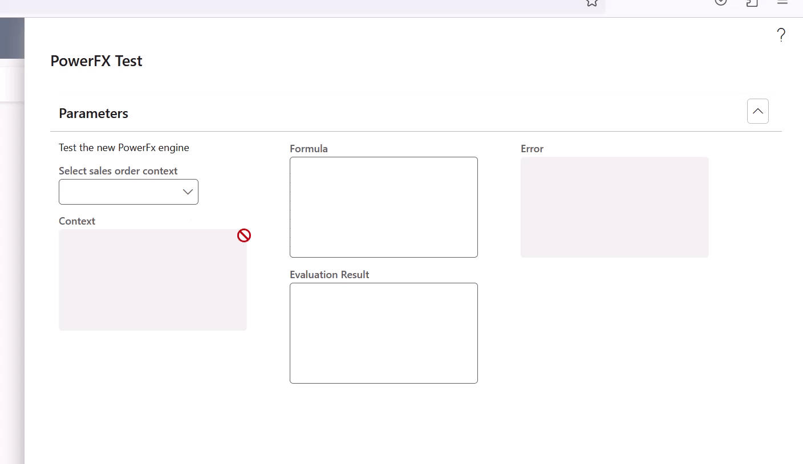

# Introduction 
Demonstrates using PowerFx in a Dynamics 365 Finance and Operations (D365F&O) environment (Platform Version PU61). PowerFx is used here to evaluate SalesOrder data.

 

Additionally the custom function **ThrowError("...")** has been added to PowerFx. There is no concret use for that in the demo, I use the function to pass errors back to D365F&O. Outside the context of that demo, I implemented the **ThrowError** function for a validation framework where the customer can define by himeself with PowerFx the validation rules and throw errors without the need of a D365F&O developer.

# Deploy and demo usage
In the folder **DeployablePackage** is a ready to deploy package for D365F&O works. Can be deployed like any other package for D365F&O. To run the demo script you then only need to call the **SysClassRunner** in the URL.

**Example: https://<your F&O url>/?cmp=<legal entity>&mi=SysClassRunner&cls=PowerFxDemoRunnable**
        
# Build
If you want to build the project by yourself on a cloud-hosted environment or local VHD image, do not forget to use the registerSymbolicLink.ps1 to link the Metadata folder to the AosService/PackagesLocalDirectory of the machine. You can also build the project on a new [Unified Experience environment](https://learn.microsoft.com/en-us/power-platform/developer/unified-experience/finance-operations-dev-overview). (2023-11-24: Unified experience environments are in preview and some features might not work).

